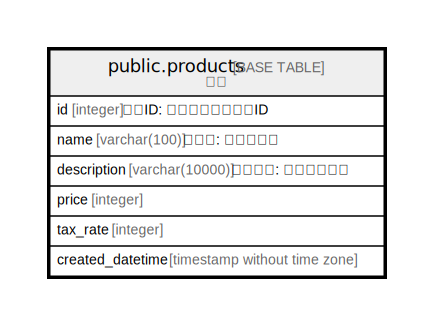

# public.products

## Description

## Columns

| Name | Type | Default | Nullable | Children | Parents | Comment |
| ---- | ---- | ------- | -------- | -------- | ------- | ------- |
| id | integer |  | true |  |  |  |
| name | varchar(100) |  | true |  |  |  |
| description | varchar(10000) |  | true |  |  |  |
| price | integer |  | true |  |  |  |
| tax_rate | integer |  | true |  |  |  |

## Relations

---

> Generated by [tbls](https://github.com/k1LoW/tbls)
