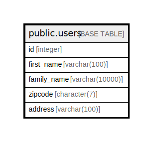

# public.users

## Description

## Columns

| Name | Type | Default | Nullable | Children | Parents | Comment |
| ---- | ---- | ------- | -------- | -------- | ------- | ------- |
| id | integer |  | true |  |  |  |
| first_name | varchar(100) |  | true |  |  |  |
| family_name | varchar(10000) |  | true |  |  |  |
| zipcode | varchar(7) |  | true |  |  |  |
| address | varchar(100) |  | true |  |  |  |

## Relations

---

> Generated by [tbls](https://github.com/k1LoW/tbls)
